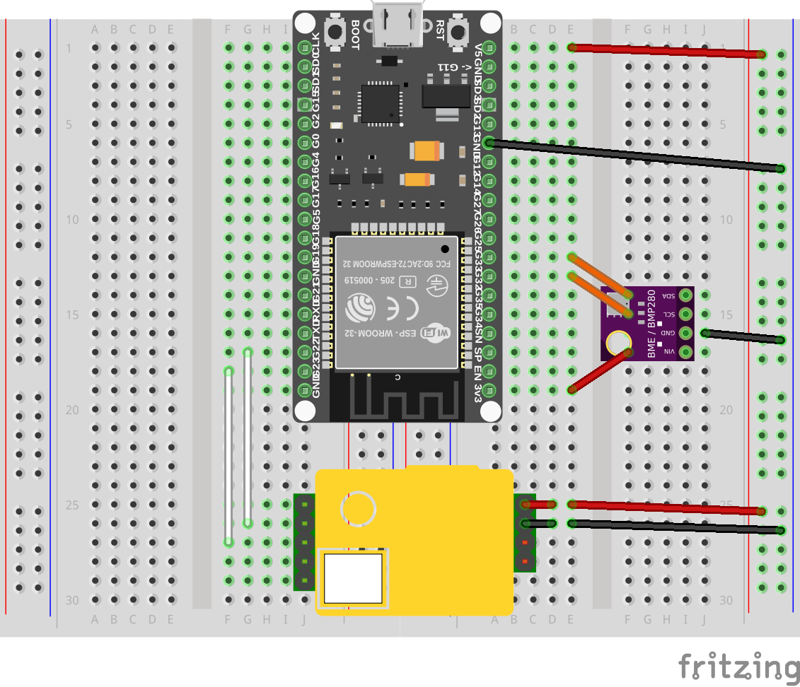
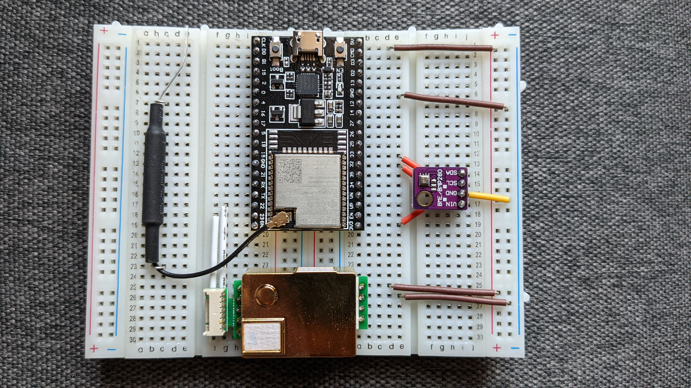

# Living Room

CO2, humidity, temperature and pressure sensor.

[ESPHome configuration][living-room-esphome]

[Fritzing project][living-room-fritzing]

| part          | shop             | esphome                  | fritzing                  |
|---------------|------------------|--------------------------|---------------------------|
| ESP32-DevKitC | [esp32-devkit][] | [esp32-devkit-esphome][] | [esp32-devkit-fritzing][] |
| MH-Z19        | [mh-z19][]       | [mh-z19-esphome][]       | [mh-z19-fritzing][]       |
| BME280        | [bme280][]       | [bme280-esphome][]       | [bme280-fritzing][]       |

[living-room-esphome]:   living-room.yaml
[living-room-fritzing]:  living-room.fzz
[esp32-devkit]:          https://www.aliexpress.com/item/4000296658456.html
[esp32-devkit-esphome]:  https://esphome.io/devices/nodemcu_esp32.html
[esp32-devkit-fritzing]: https://forum.fritzing.org/t/fritzing-part-of-an-esp32/5355/4
[mh-z19]:                https://www.aliexpress.com/item/1005002212110269.html
[mh-z19-esphome]:        https://esphome.io/components/sensor/mhz19.html
[mh-z19-fritzing]:       https://github.com/TD-er/fritzing-parts/tree/master/MH-Z19_CO2
[bme280]:                https://www.amazon.de/dp/B07FS95JXT/
[bme280-esphome]:        https://esphome.io/components/sensor/bme280.html
[bme280-fritzing]:       https://github.com/kurokky/fritzing

